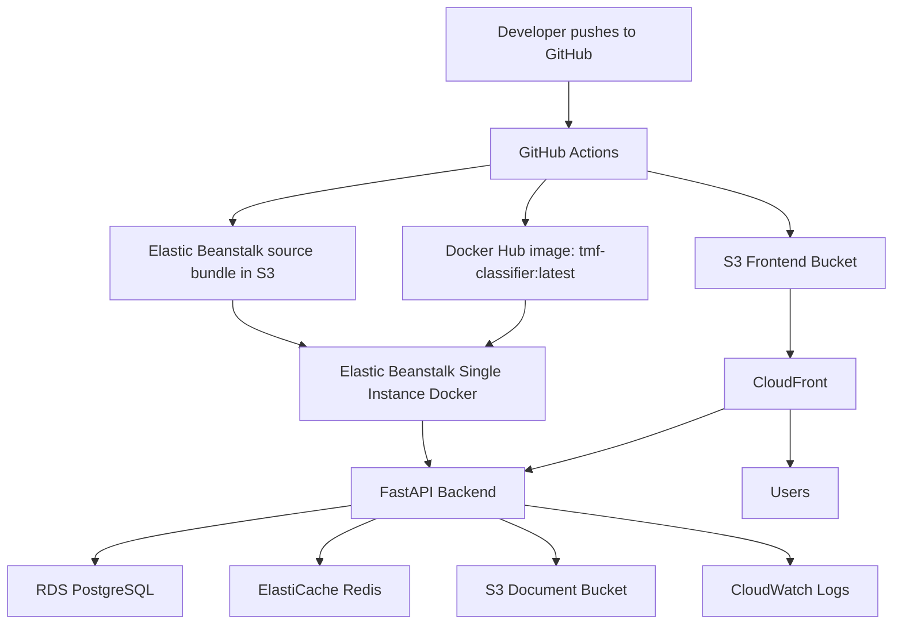

# Stage 8 AWS Deployment Guide

This guide deploys the TMF Document Classifier as a production-like portfolio POC while keeping AWS cost as low as possible.

Target stack:

- Frontend static files: Amazon S3 + CloudFront
- Backend API: Elastic Beanstalk single-instance Docker environment
- Database: Amazon RDS PostgreSQL, Single-AZ
- Cache: Amazon ElastiCache Redis, single node
- Document storage: Amazon S3
- Container registry: Docker Hub
- CI/CD: GitHub Actions
- Logs: CloudWatch

Use one region for everything except CloudFront, which is global. Recommended region: `us-east-1` or the closest low-cost AWS region you normally use.

## Deployment Order

1. Create an AWS Budget alert.
2. Create IAM deploy user or role for GitHub Actions.
3. Create S3 buckets:
   - frontend static assets
   - uploaded TMF documents
   - Elastic Beanstalk deployment bundles
4. Create security groups.
5. Create RDS PostgreSQL.
6. Create ElastiCache Redis.
7. Create Elastic Beanstalk application and single-instance Docker environment.
8. Add Elastic Beanstalk environment variables.
9. Create CloudFront distribution for the frontend and API proxy.
10. Add GitHub repository secrets.
11. Push to `main` to build Docker image, deploy backend, sync frontend, and invalidate CloudFront.
12. Verify auth, classification, RAG, Redis, S3 uploads, PostgreSQL rows, and CloudWatch logs.

## Environment Variables

Set these in Elastic Beanstalk under **Configuration > Software > Environment properties**.

```env
ENVIRONMENT=aws
PROJECT_NAME=TMF_Classifier
MODEL_VERSION=v1.0.0
DATASET_VERSION=v1.0.0

JWT_SECRET_KEY=<long-random-secret>
JWT_ALGORITHM=HS256
ACCESS_TOKEN_EXPIRE_MINUTES=60

POSTGRES_HOST=<rds-endpoint>
POSTGRES_PORT=5432
POSTGRES_DB=tmf_classifier
POSTGRES_USER=<db-user>
POSTGRES_PASSWORD=<db-password>

REDIS_URL=redis://<elasticache-primary-endpoint>:6379/0

AWS_REGION=<aws-region>
AWS_S3_BUCKET_NAME=<document-bucket-name>
LOCAL_CLOUD_ROOT=agentic_tmf_workspace

ALLOW_DUPLICATE_DOCUMENTS=False
AUTO_APPROVAL_THRESHOLD=0.90
MIN_CONFIDENCE_GAP=0.10
MANUAL_REVIEW_QUEUE_NAME=manual_review:pending

RETRAIN_MIN_NEW_DOCUMENTS=1
RETRAIN_ONLY_VERIFIED_DATA=True

MASTER_DATA_DIR=MASTER_DATA
AUTO_INDEX_MASTER_DATA=False

SEMANTIC_CACHE_ENABLED=True
SEMANTIC_CACHE_THRESHOLD=0.75
SEMANTIC_CACHE_TTL_SECONDS=86400

EMBEDDING_PROVIDER=local
LOCAL_EMBEDDING_MODEL=NeuML/pubmedbert-base-embeddings
LOCAL_MODEL_DIR=/models/pubmedbert-base-embeddings
LOCAL_EMBEDDING_DEVICE=cpu
LOCAL_EMBEDDING_BATCH_SIZE=8
RAG_EMBEDDING_DIMENSION=768
RAG_SEMANTIC_TOP_K=10
RAG_KEYWORD_TOP_K=10
RAG_FINAL_TOP_K=5
RAG_RERANKER_ENABLED=False

GEMINI_API_KEY=<only-if-using-gemini-generation>
GEMINI_EMBEDDING_MODEL=models/gemini-embedding-001
GEMINI_GENERATION_MODEL=models/gemini-flash-lite-latest
```

GitHub repository secrets:

```env
AWS_ACCESS_KEY_ID=<github-deploy-user-access-key>
AWS_SECRET_ACCESS_KEY=<github-deploy-user-secret-key>
AWS_REGION=<aws-region>

DOCKERHUB_USERNAME=<dockerhub-username>
DOCKERHUB_TOKEN=<dockerhub-access-token>

EB_APPLICATION_NAME=tmf-classifier-poc
EB_ENVIRONMENT_NAME=tmf-classifier-poc-env
EB_DEPLOY_BUCKET=tmf-poc-eb-deploy-<unique>

FRONTEND_S3_BUCKET=tmf-poc-frontend-<unique>
CLOUDFRONT_DISTRIBUTION_ID=<cloudfront-distribution-id>
```

## AWS Resources

### Elastic Beanstalk

- Purpose: run FastAPI Docker backend.
- Region: same region as RDS and ElastiCache.
- Free Tier option: single EC2 instance using `t3.micro` or `t4g.micro` where available.
- Name convention:
  - Application: `tmf-classifier-poc`
  - Environment: `tmf-classifier-poc-env`
- Exact configuration:
  - Platform: Docker on Amazon Linux 2023
  - Environment type: Single instance
  - Instance type: `t3.micro` or `t4g.micro`
  - Public IP: enabled
  - Health check path: `/health`
  - Deployment policy: All at once
  - CloudWatch log streaming: enabled
  - Log retention: 7 days
- Avoid:
  - Load balanced environment
  - Multi-instance autoscaling
  - Large EC2 instance types
  - Managed platform extras you do not need

### RDS PostgreSQL

- Purpose: metadata, users, predictions, audit logs, RAG documents/chunks.
- Region: same as Elastic Beanstalk.
- Free Tier option: PostgreSQL Single-AZ `db.t3.micro`/`db.t4g.micro` if eligible.
- Name convention:
  - DB identifier: `tmf-classifier-poc-db`
  - Database name: `tmf_classifier`
- Exact configuration:
  - Engine: PostgreSQL
  - Single-AZ
  - Public access: no
  - Storage: 20 GB gp2/gp3
  - Storage autoscaling: off or capped low
  - Backup retention: 1 day
  - Deletion protection: off for demo cleanup
  - Performance Insights: off
  - Enhanced monitoring: off
- Avoid:
  - Multi-AZ
  - Provisioned IOPS
  - Large storage
  - Long backup retention

### S3 Buckets

Create three buckets:

1. `tmf-poc-frontend-<unique>`
   - Purpose: frontend static files.
   - Recommended: keep bucket private and access through CloudFront Origin Access Control.
   - If using S3 website endpoint instead, public read policy is required. That is simpler but less secure.

2. `tmf-poc-documents-<unique>`
   - Purpose: uploaded TMF documents and extracted/processed artifacts.
   - Block public access: on.
   - Encryption: SSE-S3.
   - Lifecycle: expire temporary/demo uploads after 7-30 days.

3. `tmf-poc-eb-deploy-<unique>`
   - Purpose: Elastic Beanstalk source bundles from GitHub Actions.
   - Block public access: on.
   - Lifecycle: expire old deployment bundles after 7 days.

Avoid:

- Versioning for POC unless needed.
- Public access on document/deployment buckets.
- Retaining old deployment zips forever.

### ElastiCache Redis

- Purpose: exact cache, semantic cache, manual review queue.
- Region: same as Elastic Beanstalk.
- Free Tier option: smallest node if eligible, such as `cache.t3.micro`.
- Name convention: `tmf-classifier-poc-redis`.
- Exact configuration:
  - Redis OSS
  - Single node
  - Cluster mode: disabled
  - Replicas: 0
  - Multi-AZ: off
  - Automatic backups: off for POC
  - Inbound security group: only Elastic Beanstalk backend SG on port `6379`
- Avoid:
  - Serverless Redis unless you understand its minimum cost
  - Replicas
  - Multi-AZ
  - Backups/snapshots

### CloudFront

- Purpose: HTTPS frontend CDN and optional HTTPS API proxy to Elastic Beanstalk.
- Name convention: `tmf-classifier-poc-cdn`.
- Recommended origins:
  - Default origin: frontend S3 bucket with Origin Access Control
  - API origin: Elastic Beanstalk environment domain
- Default behavior:
  - Origin: S3 frontend bucket
  - Viewer protocol policy: redirect HTTP to HTTPS
  - Cache policy: CachingOptimized
  - Default root object: `index.html`
- API behaviors:
  - `/auth/*`
  - `/users*`
  - `/predict*`
  - `/rag/*`
  - `/agentic/*`
  - `/documents/*`
  - `/audit-logs`
  - `/model-info`
  - `/health`
  - Origin: Elastic Beanstalk
  - Allowed methods: GET, HEAD, OPTIONS, PUT, POST, PATCH, DELETE
  - Cache policy: CachingDisabled
  - Origin request policy: AllViewerExceptHostHeader, or forward Authorization, query strings, and required headers
- Avoid:
  - Custom domain/ACM/Route 53 for first demo unless needed
  - Long frontend cache on `index.html`

### IAM

Elastic Beanstalk EC2 instance profile needs only:

- S3 access to document bucket:
  - `s3:GetObject`
  - `s3:PutObject`
  - `s3:DeleteObject`
  - `s3:ListBucket`
- CloudWatch logs:
  - `logs:CreateLogGroup`
  - `logs:CreateLogStream`
  - `logs:PutLogEvents`

GitHub Actions deploy identity needs:

- Docker Hub credentials stored in GitHub, not AWS.
- S3 deploy bucket write/read for EB bundles.
- S3 frontend bucket sync permissions.
- CloudFront invalidation permission.
- Elastic Beanstalk application version and environment update permissions.

Avoid `AdministratorAccess` for long-lived users.

### Security Groups

Create:

1. `sg-tmf-eb-backend`
   - Inbound: HTTP `80` from internet for simplest POC, or from CloudFront only if you want tighter control.
   - Outbound: allow all, or at least HTTPS `443`, PostgreSQL `5432`, Redis `6379`.

2. `sg-tmf-rds-postgres`
   - Inbound: PostgreSQL `5432` from `sg-tmf-eb-backend` only.
   - No public inbound access.

3. `sg-tmf-redis`
   - Inbound: Redis `6379` from `sg-tmf-eb-backend` only.
   - No public inbound access.

### CloudWatch

- Enable Elastic Beanstalk log streaming.
- Retention: 7 days.
- Optional alarms:
  - EB environment health degraded
  - EC2 CPU > 80%
  - RDS free storage low
  - Redis CPU/memory high

Avoid indefinite log retention.

## Manual AWS Console Steps

1. Open AWS Billing.
2. Select **Budgets**.
3. Create a cost budget named `tmf-poc-budget`.
4. Set monthly budget to `$5` or `$10`.
5. Add alerts at 50%, 80%, and 100%.

6. Open S3.
7. Create bucket `tmf-poc-frontend-<unique>`.
8. Keep Block Public Access on if using CloudFront OAC.
9. Disable versioning.
10. Enable default encryption with SSE-S3.

11. Create bucket `tmf-poc-documents-<unique>`.
12. Keep Block Public Access on.
13. Disable versioning.
14. Enable default encryption with SSE-S3.
15. Add lifecycle rule to expire temporary/demo objects after 7-30 days.

16. Create bucket `tmf-poc-eb-deploy-<unique>`.
17. Keep Block Public Access on.
18. Disable versioning.
19. Add lifecycle rule to expire objects under `elasticbeanstalk/` after 7 days.

20. Open EC2.
21. Go to Security Groups.
22. Create `sg-tmf-eb-backend`.
23. Add inbound HTTP port `80` from `0.0.0.0/0` for simple POC.
24. Create `sg-tmf-rds-postgres`.
25. Add inbound PostgreSQL port `5432` from `sg-tmf-eb-backend`.
26. Create `sg-tmf-redis`.
27. Add inbound Redis port `6379` from `sg-tmf-eb-backend`.

28. Open RDS.
29. Create database.
30. Choose Standard create.
31. Choose PostgreSQL.
32. Choose Free tier template if available.
33. Set DB identifier `tmf-classifier-poc-db`.
34. Set master username and password.
35. Choose smallest/free-tier eligible DB instance.
36. Set storage to 20 GB.
37. Disable storage autoscaling or cap it low.
38. Disable Multi-AZ.
39. Set public access to No.
40. Select the VPC used by Elastic Beanstalk.
41. Attach `sg-tmf-rds-postgres`.
42. Set initial database name `tmf_classifier`.
43. Set backup retention to 1 day.
44. Disable Performance Insights and Enhanced Monitoring.
45. Disable deletion protection for demo cleanup.
46. Create database.

47. Open ElastiCache.
48. Create Redis OSS cache.
49. Choose design your own cache / node-based option.
50. Disable cluster mode.
51. Select smallest node type available.
52. Set replicas to 0.
53. Disable Multi-AZ.
54. Disable automatic backups.
55. Select same VPC as EB/RDS.
56. Attach `sg-tmf-redis`.
57. Create cache.

58. Open IAM.
59. Create or confirm Elastic Beanstalk service role.
60. Create or confirm EC2 instance profile for Elastic Beanstalk.
61. Attach least-privilege S3 document bucket and CloudWatch Logs permissions.

62. Open Elastic Beanstalk.
63. Create application.
64. Application name: `tmf-classifier-poc`.
65. Environment: Web server environment.
66. Environment name: `tmf-classifier-poc-env`.
67. Platform: Docker.
68. Platform branch: Docker running on Amazon Linux 2023.
69. Environment type: Single instance.
70. Upload a temporary source bundle containing a rendered `Dockerrun.aws.json`, or let the first GitHub Actions run create the real application version after the environment exists.
71. Open environment configuration.
72. Set instance type to smallest compatible option.
73. Attach `sg-tmf-eb-backend`.
74. Set health check path to `/health`.
75. Enable CloudWatch log streaming with 7-day retention.
76. Add all backend environment variables listed above.

77. Open CloudFront.
78. Create distribution.
79. Add S3 frontend bucket as default origin.
80. Create Origin Access Control for the bucket.
81. Set default root object to `index.html`.
82. Set viewer protocol policy to redirect HTTP to HTTPS.
83. Add Elastic Beanstalk environment URL as second origin.
84. Add API behaviors listed in the CloudFront section.
85. Disable caching for API behaviors.
86. Create distribution.
87. Copy the distribution ID and domain.

88. Update the frontend S3 bucket policy using the policy CloudFront provides for OAC.
89. Open GitHub repository settings.
90. Add all GitHub Actions secrets listed above.
91. Push to `main`.

## GitHub Deployment

The workflow does this automatically on `main`:

1. Runs smoke tests.
2. Builds the backend Docker image.
3. Pushes `latest` and commit-SHA tags to Docker Hub.
4. Renders `Dockerrun.aws.json` from `deploy/elasticbeanstalk/Dockerrun.aws.json.template`.
5. Uploads the EB bundle to the deployment S3 bucket.
6. Creates an Elastic Beanstalk application version.
7. Updates the EB environment.
8. Syncs `frontend/` to the frontend S3 bucket.
9. Invalidates CloudFront.

## Verification

Frontend:

- Open `https://<cloudfront-domain>`.
- Confirm landing/login page loads.
- Confirm CSS and JS load from CloudFront.

Backend:

- Open `https://<cloudfront-domain>/health`.
- Expect `{"status":"healthy"}`.

Login:

- Log in as:
  - `user@test.com`
  - `manager@test.com`
  - `admin@test.com`
- Confirm each role lands on the correct dashboard.

Classification:

- Upload a small `.txt`, `.pdf`, or `.docx`.
- Confirm classification result appears.
- Confirm files are stored under the document S3 bucket.

RAG:

- Ask a question in AI Document Assistant.
- Test selected document scope and all-document scope.
- Confirm RBAC denial appears when a user asks for unauthorized content.

Redis:

- Ask the same RAG question twice.
- Check Redis/cache metrics in the UI or `/rag/metrics`.
- Confirm cache hit/improvement metrics update when Redis is reachable.

PostgreSQL:

- Confirm `/auth/me`, `/documents/my-uploads`, manual review, and audit endpoints work.
- Optionally connect from a temporary EC2/CloudShell path allowed by your network and inspect tables.

S3:

- Confirm uploaded raw/extracted/metadata artifacts appear in the document bucket.

CloudWatch:

- Open CloudWatch Logs.
- Find the Elastic Beanstalk environment log group.
- Confirm startup, request, RAG, Redis, and upload logs are present.

## Simpler POC Mode Without CloudFront

If CloudFront routing is slowing down the demo, use S3 static website hosting and call Elastic Beanstalk directly.

Frontend URL:

```text
http://tmf-poc-frontend-pardhu.s3-website-us-east-1.amazonaws.com
```

Backend URL:

```text
http://tmf-classifier-poc-env.eba-uwzpynwe.us-east-1.elasticbeanstalk.com
```

Elastic Beanstalk environment variable:

```env
CORS_ALLOWED_ORIGINS=http://tmf-poc-frontend-pardhu.s3-website-us-east-1.amazonaws.com
```

GitHub Actions secret:

```env
FRONTEND_API_BASE_URL=http://tmf-classifier-poc-env.eba-uwzpynwe.us-east-1.elasticbeanstalk.com
```

In this mode, `CLOUDFRONT_DISTRIBUTION_ID` is optional. If it is not set, GitHub Actions skips CloudFront invalidation and only syncs the frontend files to S3.

## Cost Checklist

Potential charges:

- Elastic Beanstalk EC2 instance.
- RDS PostgreSQL instance and storage.
- ElastiCache Redis node.
- S3 storage and requests.
- CloudFront requests/data transfer.
- CloudWatch logs.

Keep costs low:

- Use one EB instance.
- Use smallest EC2/RDS/Redis sizes.
- Keep RDS Single-AZ.
- Avoid NAT Gateway.
- Avoid load balancer.
- Keep CloudWatch retention to 7 days.
- Keep S3 lifecycle cleanup enabled.
- Keep RDS backups to 1 day.
- Disable RDS Performance Insights and Enhanced Monitoring.

Terminate after demo:

1. Elastic Beanstalk environment.
2. RDS database.
3. ElastiCache Redis cache.
4. CloudFront distribution after disabling it.
5. S3 buckets after emptying them.
6. CloudWatch log groups.
7. EB deployment S3 bundle objects.
8. IAM access keys created for the demo.
9. Unused security groups.
10. Any accidental Elastic IPs.

## Architecture



## Architecture Review

This architecture is appropriate for a portfolio-quality POC. It keeps the core production shape, but avoids ECS, ECR, CodePipeline, NAT Gateway, Multi-AZ databases, extra load balancers, and multi-instance autoscaling.

Main issue to watch: if the frontend is served over CloudFront HTTPS but the API is called over the raw HTTP Elastic Beanstalk URL, browsers may block requests as mixed content. The simplest fix is to route API paths through CloudFront to the EB origin.

Use this setup for demos, then tear down RDS, Redis, and EB immediately afterward if you do not need the app running continuously.
